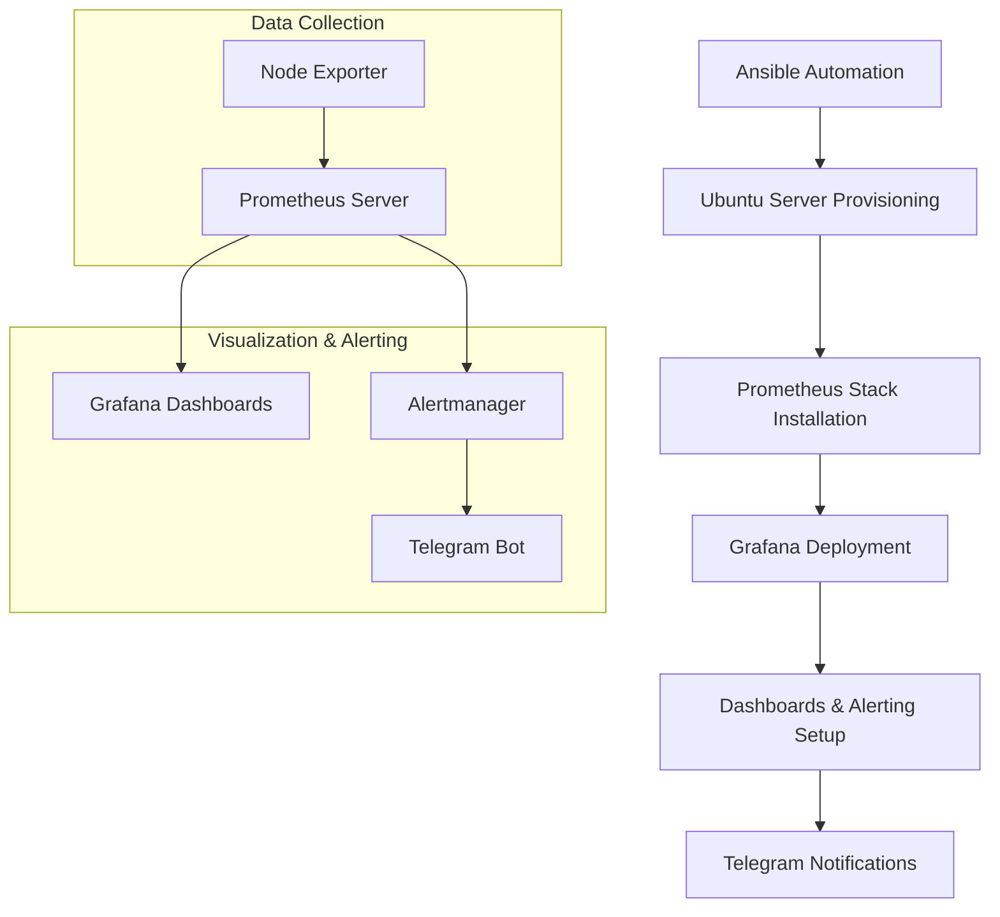

# HomeLab SRE Monitoring & Automation

[](https://ubuntu.com/)
[](https://prometheus.io/)
[](https://github.com/prometheus/node_exporter)
[](https://grafana.com)
[](https://www.ansible.com/)

## Проблема и Мотивация

Этот проект начался с критических проблем старого ноутбука **Acer Aspire E5-551G**:

-   **Циклические перезагрузки** и отказы запуска системы
-   **Постоянная 100% нагрузка** диска (HDD) даже в простое
-   **Перегрев и шумная работа** из-за постоянной высокой нагрузки
-   **Подозрение на скрытые угрозы** (майнеры, вирусы)

Диагностика выявила главную причину: **физическая смерть HDD** с битыми секторами.

**Решение:**
Вместо утилизации было принято стратегическое решение:
1.  **Апгрейд железа:** Замена HDD на современный SSD (Samsung 870 EVO)
2.  **Трансформация:** Перепрофилирование ноутбука в **энергоэффективный домашний сервер** 24/7
3.  **Практическое обучение:** Создание полигона для освоения Linux, сетей и DevOps-инструментов
4.  **Создание инфраструктуры:** Построение основы для файлового хранилища, хостинга пет-проектов и автоматизации

Проект стал инвестицией в экспертизу: от решения аппаратных проблем до построения отказоустойчивых систем.

---

## Технологический стек

Для превращения проблемного hardware в предсказуемую и управляемую систему был развернут полноценный стек мониторинга и автоматизации.

| Категория         | Технологии/Компоненты                  |
|-------------------|----------------------------------------|
| **ОС**            | Ubuntu Server 24.04.2 LTS              |
| **Сеть**          | Netplan (systemd-networkd)             |
| **Мониторинг**    | Prometheus 3.5.0, Node Exporter 1.9.1  |
| **Визуализация**  | Grafana 10.4.1                         |
| **Аналитика**     | PromQL-запросы                         |
| **Управление**    | Systemd, Grafana CLI, SQLite           |
| **Автоматизация** | Ansible 2.18.7                         |

## Архитектура решения


## Детализация компонентов

### 1. Автоматизация развертывания (Ansible)

**Роль:** Оркестрация всего процесса установки и настройки

| Компонент | Назначение | Ключевые особенности |
| --------- | ---------- | -------------------- |
| **Роль `base_setup`**  | Базовая настройка сервера | Установка пакетов, настройка времени, обновление системы |
| **Инвентарь**          | Управление хостами        | INI-формат с групповыми переменными                      |
| **Плейбуки**           | Автоматизация задач       | Обработка ошибок                                         |

**Реализованные функции:**
- Автоматическая настройка SSH (отключение парольной аутентификации)
- Установка базовых утилит мониторинга (htop, net-tools)
- Настройка часового пояса и синхронизация времени
- Обновление системы и установка зависимостей

### 2. Мониторинг (Prometheus + Node Exporter)

**Роль:** Сбор и хранение метрик

**Установка с поддержкой версий:**
```bash
# Установка стабильной версии
./install-prometheus.sh
./install-node-exporter.sh

# Установка конкретной версии
./install-prometheus.sh 2.51.2
./install-node-exporter.sh 1.7.0

# Установка последней версии
./install-prometheus.sh latest
./install-node-exporter.sh latest
```

**Собираемые метрики:**
- **Системные:** CPU, memory, disk usage, network traffic
- **Аппаратные:** Temperature, fan speed, power supply
- **Сервисы:** Service status, port availability

### 3. Визуализация (Grafana)

**Роль:** Представление данных и управление оповещениями

**Особенности реализации:**
- Автоматическая установка с настроенным Prometheus datasource
- Provisioning конфигов через YAML-файлы
- Резервное копирование дашбордов (JSON + SQLite)
- Кастомные дашборды с расширенными запросами PromQL

**Пример PromQL запросов:**
```promql
# Мониторинг температуры CPU
node_hwmon_temp_celsius{chip="coretemp-*"}  # Intel
node_hwmon_temp_celsius{chip="k10temp*"}    # AMD

# Использование памяти
100 - (node_memory_MemAvailable_bytes / node_memory_MemTotal_bytes * 100)
```

### 4. Алертинг (Alertmanager + Telegram Bot)

**Роль:** Уведомления о проблемах

**Реализованные алерты:**
- `Critical Disk Space`
- `High CPU Usage`
- `Low Available Memory`
- `Node Exporter Down`
- `High Temperature`

### Процесс развертывания

1. **Инициализация:**
   ```bash
   ./setup.sh
   ```

2. **Запуск автоматизации:**
   ```bash
   ansible-playbook playbooks/site.yml -K 
   ```

3. **Верификация:**
   - Проверка доступности Prometheus: `http://server:9090`
   - Проверка метрик Node Exporter: `http://server:9100/metrics`
   - Проверка Grafana: `http://server:3000` (admin/admin)

4. **Настройка уведомлений:**
   - Добавление Telegram bot token и chat ID
   - Настройка каналов уведомлений в Grafana
   - Тестирование алертов

### Ключевые особенности реализации

- **Версионность:** Поддержка установки specific версий компонентов
- **Безопасность:** Настройка SSH, отключение парольной аутентификации
- **Документирование:** Подробное описание проблем и решений

Этот стек технологий представляет собой production-ready решение для мониторинга, которое можно масштабировать на несколько серверов и адаптировать под конкретные задачи наблюдения за инфраструктурой.

---

## Результаты

### До внедрения
- Реактивное реагирование на инциденты
- Время простоя: **5+ часа** на восстановление
- Постоянный ручной мониторинг состояния

### После внедрения
- **Проактивное** предупреждение проблем
- **Время восстановления: < 5 минут**
- **Автоматическое развертывание** всей системы через Ansible
- **Единая точка мониторинга** всех компонентов

**Выводы:** Проект доказал, что принципы SRE применимы на любом масштабе инфраструктуры и значительно повышают её надежность.

## Будущее развитие проекта

- [ ] **Миграция на Kubernetes** для оркестрации сервисов
- [ ] **Добавление Loki** для централизованного логирования
- [ ] **Реализация мониторинга сети** (ping, трафик, QoS)
- [ ] **Настройка резервного копирования** настроек и данных
