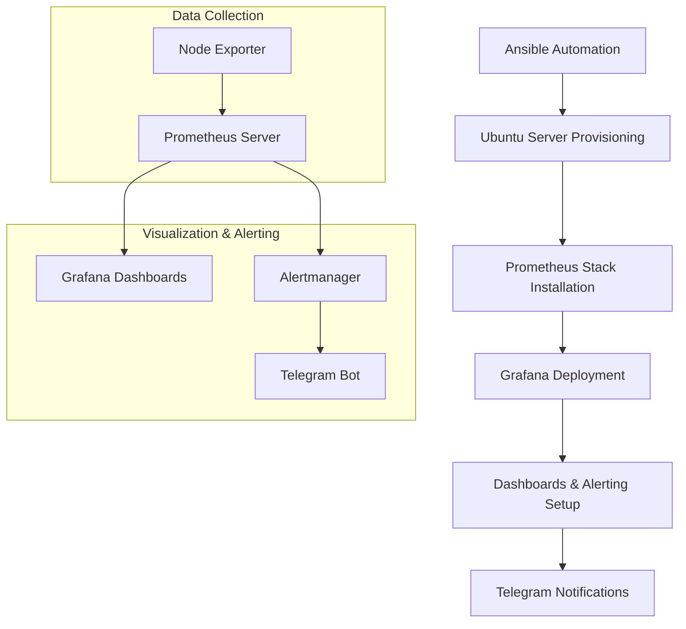

# HomeLab SRE Monitoring & Automation

[](https://ubuntu.com/)
[](https://prometheus.io/)
[](https://github.com/prometheus/node_exporter)
[](https://grafana.com)
[](https://www.ansible.com/)

## Проблема и Мотивация

Этот проект начался с критических проблем старого ноутбука **Acer Aspire E5-551G**:

-   **Циклические перезагрузки** и отказы запуска системы
-   **Постоянная 100% нагрузка** диска (HDD) даже в простое
-   **Перегрев и шумная работа** из-за постоянной высокой нагрузки
-   **Подозрение на скрытые угрозы** (майнеры, вирусы)

Диагностика выявила главную причину: **физическая смерть HDD** с битыми секторами.

**Решение:**
Вместо утилизации было принято стратегическое решение:
1.  **Апгрейд железа:** Замена HDD на современный SSD (Samsung 870 EVO)
2.  **Трансформация:** Перепрофилирование ноутбука в **энергоэффективный домашний сервер** 24/7
3.  **Практическое обучение:** Создание полигона для освоения Linux, сетей и DevOps-инструментов
4.  **Создание инфраструктуры:** Построение основы для файлового хранилища, хостинга пет-проектов и автоматизации

Проект стал инвестицией в экспертизу: от решения аппаратных проблем до построения отказоустойчивых систем.

---

## Технологический стек

Для превращения проблемного hardware в предсказуемую и управляемую систему был развернут полноценный стек мониторинга и автоматизации.

| Категория         | Технологии/Компоненты                  |
|-------------------|----------------------------------------|
| **ОС**            | Ubuntu Server 24.04.2 LTS              |
| **Сеть**          | Netplan (systemd-networkd)             |
| **Мониторинг**    | Prometheus 3.5.0, Node Exporter 1.9.1  |
| **Визуализация**  | Grafana 10.4.1                         |
| **Аналитика**     | PromQL-запросы                         |
| **Управление**    | Systemd, Grafana CLI, SQLite           |
| **Автоматизация** | Ansible 2.18.7                         |

## Архитектура решения


---

## Установка Prometheus & Grafana с поддержкой версий

Скрипты установки поддерживают несколько режимов работы с версиями:

### 1. Установка стабильной версии (по умолчанию)
```bash
# Prometheus
./install-prometheus.sh

# Node Exporter
./install-node-exporter.sh
```

### 2. Установка последней версии
```bash
# Prometheus
./install-prometheus.sh latest

# Node Exporter
./install-node-exporter.sh latest
```

### 3. Установка конкретной версии
```bash
# Prometheus v3.0.0
./install-prometheus.sh 3.0.0

# Node Exporter v1.5.0
./install-node-exporter.sh 1.5.0
```

### Основные функции
- Сбор системных метрик (CPU, RAM, Disk, Network)
- Мониторинг состояния сервера в реальном времени
- Готовые конфиги для быстрого развертывания

## Grafana Setup & Dashboard Management

### 1. Install Grafana
```bash
./install-grafana.sh
```

### 2. First Access
- URL: `http://your-server-ip:3000`
- Default login/password: `admin/admin` (change)

### 3. Import Dashboards
#### From Grafana.com:
1. By ID (for example 1860 for Node Exporter Full)
2. In Grafana: Create → Import → Enter ID → Load
3. Select Prometheus datasource → Import

### 4. Create Custom Dashboard
1. **Add visualization** → Select data source (prometheus)
2. **Write PromQL** → Set options → Apply
3. **Settings** → Save dashboard

#### (For example, PromQL) Temperature Monitoring
```promql
node_hwmon_temp_celsius{chip="coretemp-*"}  # Intel
node_hwmon_temp_celsius{chip="k10temp*"}    # AMD
```

### 5. Backup Dashboards
1. Export all dashboards
```bash
sudo cp /var/lib/grafana/grafana.db ~/grafana-backup.db
```
2. Exporting dashboards to JSON files
```bash
# Installing library to work with db
sudo apt install -y sqlite3

# Folder for json files
mkdir -p ~/grafana-export

for uid in $(sqlite3 ~/grafana-backup.db "SELECT uid FROM dashboard"); do data=$(sqlite3 ~/grafana-backup.db "SELECT data FROM dashboard WHERE uid = '$uid'"); echo "$data" > ~/grafana-export/"${uid}".json; done
```


## Автоматизация базовой настройки серверов с помощью Ansible

Реализована инфраструктура как код для автоматической настройки:
- Базовой конфигурации Ubuntu серверов
- Установки необходимых пакетов
- Настройки безопасности SSH
- Обновления системы

### Компоненты:
1. Роль `base_setup`:
   - Установка базовых пакетов (htop, net-tools, curl и др.)
   - Настройка часового пояса (Europe/Moscow)
   - Конфигурация SSH (отключение парольной аутентификации)
   - Добавление SSH-ключа для доступа
   - Обновление всех пакетов системы

2. Структура проекта:
   - Инвентарь в формате INI
   - Разделение на роли и плейбуки
   - Централизованное управление переменными
   - Все чувствительные данные хранятся локально

### Установка
#### 1. Запустите интерактивную настройку
```bash
./setup.sh
```
#### 2. Запустите плейбук
```bash
ansible-playbook playbooks/site.yml -K
```

---

## Результаты

### До внедрения
- Реактивное реагирование на инциденты
- Время простоя: **5+ часа** на восстановление
- Постоянный ручной мониторинг состояния

### После внедрения
- **Проактивное** предупреждение проблем
- **Время восстановления: < 5 минут**
- **Автоматическое развертывание** всей системы через Ansible
- **Единая точка мониторинга** всех компонентов

**Выводы:** Проект доказал, что принципы SRE применимы на любом масштабе инфраструктуры и значительно повышают её надежность.

## Будущее развитие проекта

- [ ] **Миграция на Kubernetes** для оркестрации сервисов
- [ ] **Добавление Loki** для централизованного логирования
- [ ] **Реализация мониторинга сети** (ping, трафик, QoS)
- [ ] **Настройка резервного копирования** настроек и данных
